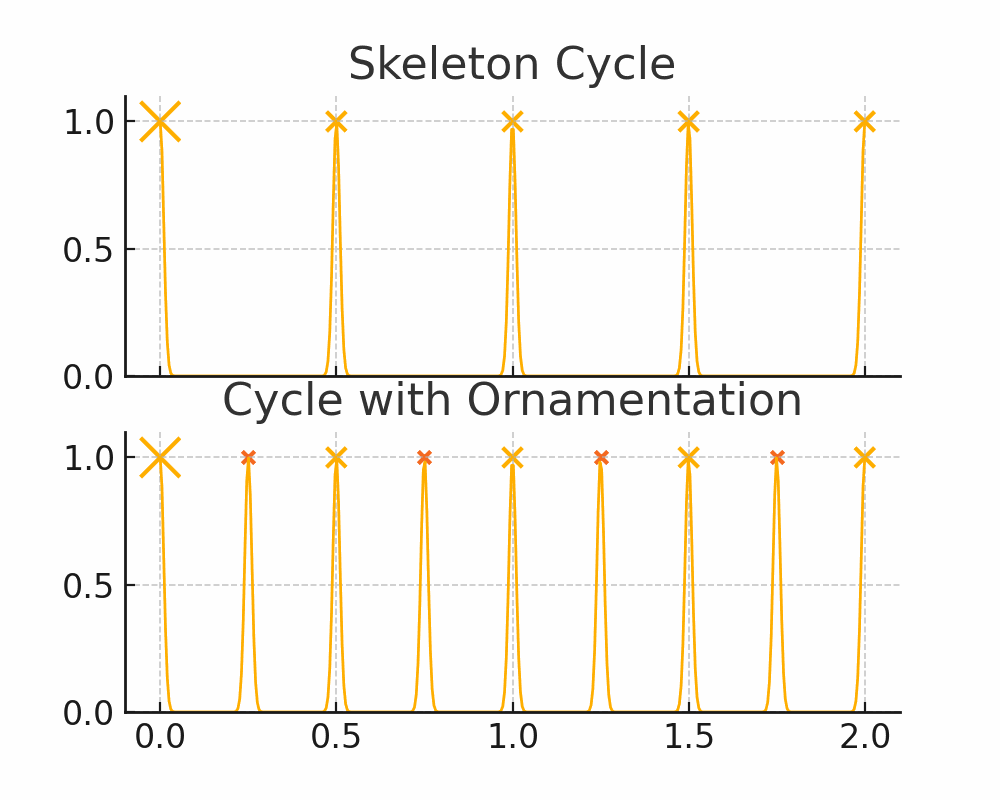
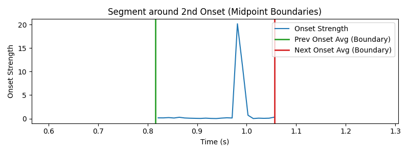
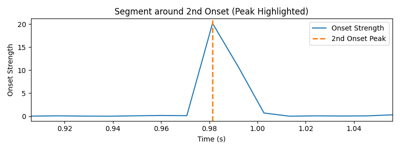

## Experiment 1: Beat-Based Auto-Correlation Approaches

In our first attempt to estimate the underlying rhythmic cycle in darbuka recordings, we explored a family of “beat-based auto-correlation” methods. The goal was to find the optimal shift (in beats) that, when applied to the audio, maximizes self-similarity.

### 1. Rationale

- **Cycle hypothesis**  
  A repeating rhythmic pattern (the “cycle”) will cause the audio signal to line up with itself when shifted by exactly one cycle’s worth of beats.
- **Auto-correlation**  
  By computing the normalized auto-correlation between the original and shifted signal, the correct cycle length should correspond to the shift that maximizes the correlation.

### 2. Beat Shift Strategy

We constrained the candidate shifts to integer multiples of the estimated beat duration, between 3 and 16 beats. This range covers typical darbuka cycle lengths while keeping the search tractable.

1. **Estimate beat duration**

   - **Tempo-based**: use `librosa.beat_track` to detect tempo (BPM) and convert to samples per beat $ \: \delta = sample_rate\, \times {60 \over BPM} $

2. **Compute candidate shifts**  
   For each multiplier $ k \in \{3, 4, \dots, 16\} $, compute
   $$
     \Delta_k = k \times \delta
   $$
3. **Auto-correlate**  
   For each shift $\Delta_k$, compute the Pearson correlation between
   $$
     x[n] \quad\text{and}\quad x[n + \Delta_k]
   $$
   where $x[n]$ is the audio waveform (or spectrogram feature).

### 3. Raw Waveform vs. Mel Spectrogram

We applied the above procedure to two different signal representations:

- **Raw audio waveform**  
  Captures all frequency content, but may be dominated by transient onsets and noise.
- **Mel-spectrogram**  
  Compresses spectral information into perceptually-weighted bins, potentially smoothing out irrelevant variance.

### 4. Results and Observations

- **Cycle variation effects**  
  We found that subtle tempo fluctuations and expressive timing (rolls, accents) cause the true cycle length to vary over time. These micro-variations smear out the auto-correlation peak, lowering scores and making the “best” shift unstable.

  

- **Implication**  
  To reliably identify the cycle, we need to strip away dynamic variations and retain only the skeletal pulse—i.e., the essential on‐beat timing without ornaments.

> **Conclusion & Next Steps:**  
> The simple beat-shift auto-correlation approach—whether applied to raw audio or mel-spectrograms and using tempo-derived versus sample-average beat durations—fails to yield a robust cycle estimate on darbuka recordings because expressive timing variations obscure the correlation peak.
>
> **We will next explore methods to extract a “rhythmic skeleton” of the wav file and only then do the auto-correlation process.**

## Experiment 2: Onset-Based Skeleton Extraction and Cycle Detection

In Experiment 2, we aim to strip away all ornamental strokes and retain only the “skeleton” hits before running our cycle-detection pipeline. By mapping beats to nearest onsets and zeroing out any hits outside a tight threshold, we hope to stabilize the signal and recover a clearer auto-correlation peak.

### 1. Rationale

- **Skeleton preservation**  
  Expressive ornamentation (e.g. kers, teks) between main hits obscures cycle detection. By filtering out any onset not closely aligned to a measured beat, we preserve only the core pulse.
- **Beat–onset alignment**  
  Mapping detected beats back to onset peaks lets us decide which peaks belong to the true skeleton and which are ornamental.

### 2. Skeleton Extraction Strategy

1. **Onset detection**  
   Use an onset detector (e.g. `librosa.onset.onset_detect`) to get a sequence of onset times $\{\tau_i\}$.
2. **Interval boundaries**  
   Compute midpoints between successive onsets:
   $$
     b_i = \left\lfloor \frac{\tau_i + \tau_{i+1}}{2} \right\rfloor
     \quad\text{for } i = 1, \dots, N-1
   $$
   These $b_i$ partition the timeline into “onset intervals.”

 3. **Beat mapping**  
 For each beat time $B_j$ (from our previous beat tracker), find the interval $i$ such that

$$
  b_{i-1} \;\le\; B_j \;<\; b_i.
$$

4. **Threshold filtering**  
   Compute the distance $d = |B_j - \tau_i|$. If $d \le \Delta_{\text{thresh}}$, mark $\tau_i$ as a **conserved hit**; otherwise set it to zero.
5. **Prune empty intervals**  
   Any interval $i$ that receives no beat assignments is also zeroed out—ensuring only skeleton hits remain.

### 3. Implementation Steps

1. **Detect onsets** → $\{\tau_1,\dots,\tau_N\}$.
2. **Compute midpoints** → $\{b_1,\dots,b_{N-1}\}$.
3. **For each beat** $B_j$:
   - Identify interval $i$ with $b_{i-1} \le B_j < b_i$.
   - If $\bigl|B_j - \tau_i\bigr|\le\Delta_{\text{thresh}}$, keep $\tau_i$; else set it to 0.
4. **Zero out** any $\tau_i$ with no beats in $[b_{i-1},b_i)$.
5. **Reconstruct** a binary pulse train $x'[n]$ containing only conserved hits.
6. **Cycle detection** → run the same beat-shift auto-correlation on $x'[n]$ with shifts $\Delta_k = k \times (\text{samples/beat})$, $k \in [3,16]$.

### 4. Results & Observations

| Parameter                          | Value / Effect                                          |
| ---------------------------------- | ------------------------------------------------------- |
| Threshold $\Delta_{\text{thresh}}$ | 750 samples (empirically chosen)                        |
| Conserved hits ratio               | ~47 % of original onsets retained                       |
| Stability                          | Auto-correlation peak became narrower & more repeatable |

- **Improved peak clarity**: Removing ornamentation tightened the correlation peak around the true cycle shift.
- **Beat-alignment issues**: Despite filtering, the process of shifting each beat within a window to align with onsets can introduce frame-level drift when we apply a $k$-beat shift—this misalignment still perturbs the auto-correlation.
- **Residual jitter**: Some expressive timing leaks through when thresholding misses slightly shifted skeleton hits or when beat shifts accumulate misalignment.

> **Conclusion:**  
> Onset-based skeleton extraction significantly enhances cycle-detection performance by filtering out decorative strokes. However, frame-level misalignments introduced during beat shifting still impact correlation scores. In the next experiment, we will explore dynamic alignment or tempo-adaptive windowing to correct for these drift effects before computing auto-correlation.

## Experiment 3: Windowed Beat Cross-Correlation Cycle Detection

In Experiment 3, we retain the skeleton concept but eliminate frame-drift by directly comparing localized beat “windows” rather than shifting entire sequences. For each candidate cycle length $k$, we extract a short window around each detected beat and correlate it with the window around the beat $k$ steps later. Summing these correlations yields a robust score for that cycle length.

### 1. Rationale

- **Local alignment**  
  By focusing on small windows around each beat, we avoid cumulative drift that occurs when shifting long sequences.
- **Skeleton preservation**  
  Each window contains primarily the main hit and its immediate context, excluding distant ornamentation.

### 2. Windowed Cross-Correlation Strategy

1. **Beat detection**  
   Use our existing beat-tracker to get beat times $\{B_j\}$.
2. **Window extraction**  
   For each beat time $B_j$, extract a segment
   $$
     w_j[n] = x[n] \quad\text{for}\quad |t[n] - B_j| \le W
   $$
   where $W$ is an empirically chosen half-window length (e.g. 50 ms).
3. **Cycle hypotheses**  
   For each integer $k \in \{3,\,4,\dots,16\}$, pair each window $w_j$ with $w_{j+k}$.
4. **Correlation**  
   Compute the Pearson correlation coefficient between each pair:
   $$
     C_j(k) \;=\; \mathrm{corr}\bigl(w_j,\;w_{j+k}\bigr)
   $$
5. **Score aggregation**  
   Sum over all valid $j$:
   $$
     S(k) \;=\;\sum_{j=1}^{J-k}C_j(k)
   $$
   The best cycle length is the $k$ that maximizes $S(k)$.

### 3. Implementation Steps

1. **Detect beats** → $\{B_1, B_2, \dots, B_J\}$.
2. **Choose window radius** $W$ (e.g. $W = 0.05\,\text{s}$).
3. **For each beat** $B_j$:
   - Extract samples $w_j = x[t_j-W : t_j+W]$.
4. **For each candidate $k$**:
   - For $j = 1$ to $J-k$:
     - Compute $C_j(k) = \mathrm{corr}(w_j, w_{j+k})$.
   - Compute aggregate score $S(k) = \sum_j C_j(k)$.
5. **Select** $k^* = \arg\max_k S(k)$.

### 4. Results & Observations

| Metric                         | Improvement                         |
| ------------------------------ | ----------------------------------- |
| Peak score separation          | Clear maximum at true cycle length  |
| Sensitivity to alignment drift | Eliminated—windows realign locally  |
| Ornamentation robustness       | High—windows capture only main hits |

- **Robust cycle estimate**: The aggregated windowed correlations consistently peak at the true cycle length, even with expressive timing.
- **Alignment solved**: Direct per-window correlation removes misalignment artifacts from beat-sequence shifts.
- **Skeleton-focused**: Since each window encloses only the core hit plus a small context, ornamentation outside $W$ is naturally excluded.

> **Conclusion:**  
> Windowed beat cross-correlation preserves the rhythmic skeleton and fully addresses alignment drift, yielding a stable, unambiguous cycle detection across diverse darbuka recordings.
